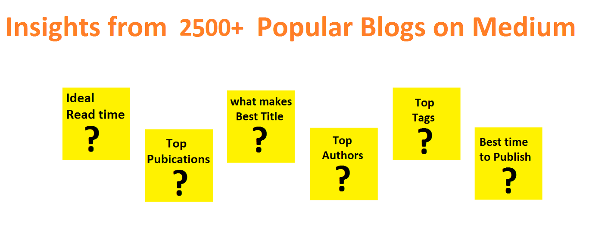

# Medium-Popular-Articles-Analysis
This analysis is done on 2500+ [Medium popular blogs](https://medium.com/topic/popular) to find out the important patterns among them.

## About Data
I have scraped 2701 unique popular articles from Medium.com.

For each article we have Title, Date, Author, Publication, Read time, Claps and Tags.

## Dependencies
* Python
* matplotlib
* pandas
* selenium

All dependencies can be installed using [pip](https://pip.pypa.io/en/stable/)

## Analysis Overview:
I wrote a [blog](https://medium.com/@shareefshaik1375/) covering all the findings of this analysis in detail, I recommend you to refer it for more clear understanding.

